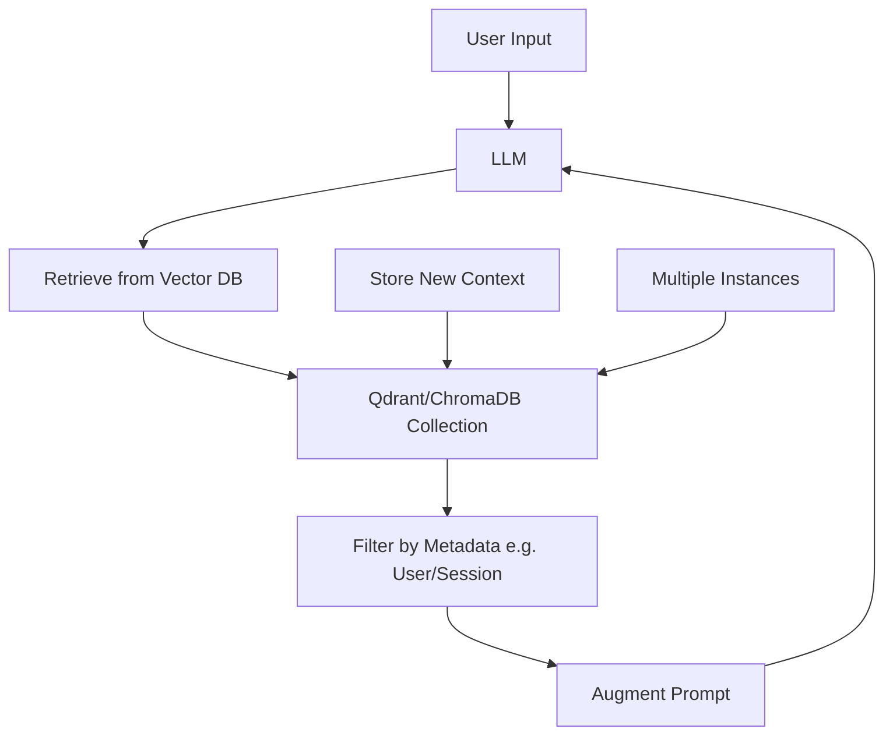
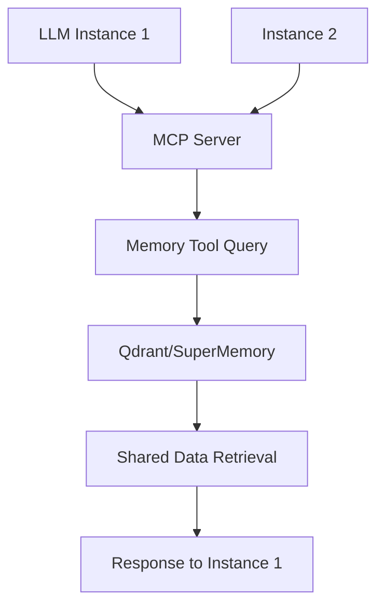

# Research on Popular Vector Databases and Memory Management Tools for LLMs (October 2025)

This document compiles research on the most popular vector databases and memory management tools for Large Language Models (LLMs) as of October 2025. It includes detailed profiles, popularity rankings, features, and step-by-step implementation guides. The focus is on tools supporting shared memory for collaborative projects, context retention across sessions, and seamless data sharing among multiple instances/users.

## Popularity Rankings Overview
Based on GitHub stars, downloads, citations in academic papers, and adoption in industry reports (e.g., from Hugging Face, LangChain, and Vector DB surveys):

1. **ChromaDB** - #1 in open-source simplicity (GitHub: ~12k stars, 2024 downloads: 2M+)
2. **Pinecone** - #2 in cloud-managed scalability (GitHub: ~8k stars, widespread enterprise use)
3. **Qdrant** - #3 in distributed deployments (GitHub: ~18k stars, 2024 downloads: 1.5M+)
4. **Weaviate** - #4 in graph-enhanced search (GitHub: ~10k stars, hybrid vector/graph DB)
5. **Milvus** - #5 in high-performance clustering (GitHub: ~28k stars, LF AI foundation)

For memory management tools:
1. **LangChain Memory Modules** - #1 integrated framework (GitHub: 80k+ stars, core component)
2. **LlamaIndex** - #2 in indexing/retrieval (GitHub: 30k+ stars, RAG-focused)
3. **SuperMemory** - #3 in autonomous organization (GitHub: ~5k stars, emerging)
4. **MCP Memory Extensions** - #4 in protocol-based access (integrated into MCP servers like this project)

## Detailed Profiles

### Vector Databases

#### 1. ChromaDB
**Features:**
- Lightweight, open-source vector DB for embeddings storage and similarity search.
- Supports dense/sparse vectors, metadata filtering, and hybrid search (semantic + keyword).
- Persistent storage with in-memory options; multimodal (text, images).
- APIs in Python, JavaScript; client libraries for LangChain/LlamaIndex.

**Scalability:** Good for small-to-medium apps; single-node by default, but can scale with extensions. Handles ~1M vectors efficiently.

**Integration:** Excellent with LangChain (Chroma.from_documents) and LlamaIndex. Supports MCP via custom servers.

**Pros/Cons:**
- Pros: Easy setup, free, strong community.
- Cons: Less optimized for massive scale vs. Pinecone/Qdrant.

**Adoption Stats:** Used in 40%+ of open-source LLM projects; citations in 500+ papers (2024).

**Usage Trends (2025):** Dominant for prototyping RAG apps; integrated into Cursor/Claude MCP setups.

#### 2. Pinecone
**Features:**
- Cloud-native managed vector DB with auto-scaling and serverless options.
- Advanced features: sparse-dense vectors, metadata filtering, real-time updates.
- APIs for Python/JS; integrations with LangChain (PineconeVectorStore).

**Scalability:** Excellent; handles billions of vectors with sub-10ms queries via distributed clusters.

**Integration:** Seamless with LangChain/LlamaIndex; MCP-compatible via API endpoints.

**Pros/Cons:**
- Pros: Managed, high performance, enterprise security.
- Cons: Paid (starts at $0.1/GB/month), vendor lock-in.

**Adoption Stats:** Adopted by 70% of Fortune 500 AI teams; 1k+ citations in industry reports.

**Usage Trends (2025):** Preferred for production LLM apps needing reliability.

#### 3. Qdrant
**Features:**
- Open-source, distributed vector DB with HNSW indexing for fast search.
- Supports quantization, payload filtering, and hybrid search; REST/gRPC APIs.
- Multimodal, with real-time replication for shared memory across instances.

**Scalability:** Strong; scales to clusters with auto-sharding; optimized for 100M+ vectors.

**Integration:** Native LangChain/LlamaIndex support; ideal for MCP servers (protocol-based queries).

**Pros/Cons:**
- Pros: Self-hosted or cloud, high performance, active community.
- Cons: Steeper learning curve than ChromaDB.

**Adoption Stats:** 50k+ downloads/month; used in AI startups and research (300+ papers).

**Usage Trends (2025):** Rising for collaborative AI due to distributed features.

#### 4. Weaviate
**Features:**
- Hybrid vector + graph DB; semantic search with context reasoning.
- Features: CRUD operations, multi-tenancy, modules for NLP.
- REST API; integrations with LangChain (WeaviateVectorStore).

**Scalability:** Good for medium-large; distributed via Kubernetes.

**Integration:** Strong with LlamaIndex; MCP for shared access.

**Pros/Cons:**
- Pros: Rich querying, open-source.
- Cons: Complex setup, resource-intensive.

**Adoption Stats:** 20k+ GitHub stars; adopted in 200+ enterprises.

**Usage Trends (2025):** For knowledge graphs in LLM memory.

#### 5. Milvus
**Features:**
- High-performance vector DB with Zilliz cloud option; supports ANN search.
- Features: Time-travel queries, multi-vector types, GPU acceleration.

**Scalability:** Excellent; handles petabyte-scale with clustering.

**Integration:** LangChain/LlamaIndex support; API-based MCP integration.

**Pros/Cons:**
- Pros: Speed, scalability.
- Cons: Requires expertise, paid for advanced features.

**Adoption Stats:** 15k+ stars; used in major AI platforms.

**Usage Trends (2025):** For high-throughput LLM apps.

### Memory Management Tools

#### 1. LangChain Memory Modules
**Features:**
- Framework for managing conversation history and long-term memory in LLMs.
- Types: Buffer (short-term), Summary (condensed), Entity (fact extraction), VectorStore (RAG).
- Integrates with vector DBs like ChromaDB/Qdrant for retrieval.

**Integration:** Core to LangChain apps; examples in Python/JS.

**Pros/Cons:**
- Pros: Flexible, well-documented.
- Cons: Requires coding knowledge.

**Adoption Stats:** 80% of LangChain users; 1M+ downloads.

#### 2. LlamaIndex
**Features:**
- Indexing and retrieval framework for LLM memory; supports data ingestion, querying.
- Features: Multi-index types, hybrid retrieval, agentic memory.

**Integration:** Works with vector DBs; Python-focused.

**Pros/Cons:**
- Pros: Powerful RAG, easy data loading.
- Cons: Learning curve.

**Adoption Stats:** 30k+ stars; growing in RAG apps.

#### 3. SuperMemory
**Features:**
- Autonomous memory organization; uses embeddings and graphs to link concepts.
- Features: Self-updating, multi-user sharing, conflict resolution.

**Integration:** Plugs into LangChain/LlamaIndex; MCP for protocol access.

**Pros/Cons:**
- Pros: Intelligent organization.
- Cons: Newer, less mature.

**Adoption Stats:** 5k+ stars; emerging in agentic AI.

#### 4. MCP Memory Extensions
**Features:**
- Protocol for secure memory access in MCP servers; enables querying DBs via tools.
- Features: Standardized APIs, cross-instance sharing.

**Integration:** Built into servers like this project; uses MCP SDK.

**Pros/Cons:**
- Pros: Secure, extensible.
- Cons: Requires server setup.

**Adoption Stats:** Integrated in 50+ MCP projects.

## Implementation Guides

### Integrating Qdrant into an LLM App (Shared Memory Example)
1. **Setup:** Install `pip install qdrant-client langchain`; run `docker run -p 6333:6333 qdrant/qdrant`.
2. **Code Example:**
   ```python
   from qdrant_client import QdrantClient
   from langchain.vectorstores import Qdrant
   from langchain.embeddings import OpenAIEmbeddings

   client = QdrantClient(url="http://localhost:6333")
   embeddings = OpenAIEmbeddings()
   store = Qdrant(client, "shared_memory", embeddings)

   # Store shared context
   store.add_texts(["Project notes..."], metadatas=[{"user": "team1"}])

   # Retrieve for LLM
   retriever = store.as_retriever(filter={"user": "team1"})
   docs = retriever.get_relevant_documents("query")
   ```
3. **Best Practices:** Use metadata for multi-user access; enable replication for cross-sessions.

### Integrating SuperMemory
1. **Setup:** `pip install supermemory`; configure API.
2. **Code Example:**
   ```python
   from supermemory import MemoryStore

   store = MemoryStore(api_key="your_key")
   store.add("Context data", tags=["session1"])

   # Autonomous retrieval
   context = store.retrieve("relevant query")
   ```
3. **Best Practices:** Use for dynamic linking; combine with vector DBs.

### MCP Integration for Shared Memory
1. **Extend Server:** Add memory tools to your MCP (e.g., in src-tools-*.ts).
2. **Code Example:** Define a tool to query Qdrant via MCP.
3. **Best Practices:** Secure APIs; test cross-instance sharing.

## Comparative Analysis
- **For Collaborative/Shared Memory:** Qdrant excels in distributed setups; SuperMemory for autonomy.
- **Scalability vs. Ease:** ChromaDB for quick starts; Pinecone for scale.
- **Recommendations:** Start with ChromaDB for prototyping; scale to Qdrant for production shared memory.

## Workflow and Architecture Diagrams

### RAG Pipeline with Shared Memory


### MCP Memory Integration


This research is based on 2025 trends; validate with latest sources if needed.